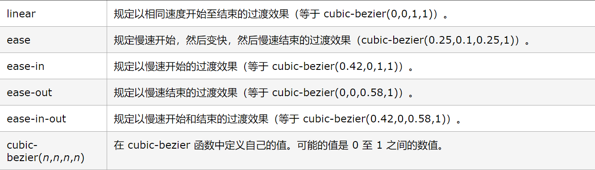

# 第一天  git和github

- git:版本控制工具

- github：网站、远程代码管理仓库、贵圈基友平台


## 集中式  分布式
     集中式缺点：
          必须联网、比较慢、都是用一个中央服务器，有可能会造成数据丢失
     
     分布式：
          不用联网就能进行版本控制，速度快


## 初始化版本控制状态
1. 找到要控制的文件目录
2. 鼠标右键，找到git bash here
3. 打开控制台，输入git init

     版本控制都是基于.git这个隐藏文件的，如果不小心把.git文件删除，就不能进行版本控制

     查看git状态
          git status
     通过Tab键补全文件

     通过ll或者ls查看目录的文件

     通过上下键去切换刚才输入的命令

     工作区到暂存区
         
          git add  指定文件名
          git add . 把当前目录所有文件都放到暂存区
     暂存区到版本区
         
          git commit -m '注释(你能直接识别的注释即可)'     
     快速把工作区到版本区（已经被管理过的文件）

          git commit -a -m ''
     注意：
          上面这个命令，前提条件是文件已经提交过一次才可以使用

     查看版本：
          git log
          git reflog （操作的多的用这个）
     
     查看每个区域的不同点：
          工作区和暂存区的区别：
               git diff
          工作区和版本区的区别
               git diff master
          暂存区跟版本区的区别：
               git diff --cached

## 设置作者信息

- 设置邮箱   git config --global user.name "你的名字(英文的)"
- 设置用户名  git config --global user.email "你的邮箱(能够收到右键的邮箱)"

## 创建过滤指定文件
- 创建一个.gitignore的文件
- touch .gitignore (创建文件) 
- 配置过滤项 
      /create.txt
      node_modules/ 

     - 如果说配置不起作用，可以先把之前的操作清除一下，在操作
         
          清楚命令
          git rm -r --cached 

     撤销回滚：
          git reset --hard 版本ID 
     
## github

     1.在github上创建一个项目
     2.绑定密钥
          ssh-keygen -t rsa -C "your_email@example.com"
          检测是否绑定（在联网的情况下）
          ssh -T git@github.com

     3.确定版本库是最新的（没有东西可提交了）
     4.查看远程仓库
          git remote -v (使用git init的时候是查不出东西的)
     5.添加远程仓库
          git remote add origin(这个名字是可以改变的)
     
     6.git pull origin master(保证能够成功上传，进行远程和本地相合并)

     7.git push origin master 上传（第一次会出现让你输入用户名和密码）

第二种方式     
     1.先在远程仓库中创建一个项目
     2.git clone 项目的地址
     3.git add .      git commit -m ''
     4.git push origin master  
## node
     NPM 跟着node安装一起安装下来的模块

     NPM 是目前时间上最大的资源管理平台

     Yran 最快的资源管理平台

     创建项目 
          npm init -y 会生成一个package.json的文件，这个文件里面放的是所有的项目配置依赖

     如何下载资源？
          npm install 资源名
               -g 全局安装
               -S 项目依赖
     下载下来的时候会自动生成一个node_modules的文件夹，文件夹中放的就是你需要的资源

      npm uninstall 删除安装程序       
# 第二天 变量提升、闭包作用域

## 变量提升 
     JS引擎会一开始，就解析全局作用域中的所有var的变量和function

     会通过函数比undefined要大（留下的是函数），还要后面的函数会把前面的函数覆盖的原则进行变量值最后的赋值确认
     
     逐行解读代码
          读打印、输出、赋值（=）
### 作用域
     域：范围  JS执行的范围(环境) 

- 全局作用域（window执行栈）·           
     如果有多个script标签，上一个script标签报错是不会影响下面script中的代码执行的

     查找的方式，先看当前的script有没有，没有还会去上一个script标签中查找，如果确实找不到，就会报错

- 局部作用域（函数中的执行栈）
     当函数执行的时候，开辟了一个执行栈，把函数中存的字符串运行在这个执行栈中
     1.形参赋值
     2.变量提升
     3.执行上下文
     4.执行栈销毁
     
     作用域链：
          如果局部作用域中没有变量（var、let）、函数、形参的时候，就会查找函数外面的变量，直到window为止

          如果局部作用域中只有变量（var、let）会直接找这个变量，是不会去函数外进行查找的

          如果局部作用域中有变量（var、let）、形参的时候，会优先形参

          如果局部作用域中有函数、变量（var、let）、形参的时候，优先函数体内的函数，并不是参数
      
      - 块级作用域

## this
- 全局this window 

```js
console.log(this) window
fn();  window

(funciton(){
     console.log(this)
})()

```
- 事件this  事件触发的对象

- 对象下的this 指向.前面的主
```js
     ojb = {
          style:{
               fn:function(){
                    console.log(this)
               }
          }
     }
     obj.style.fn(); //this->obj.style
```

## 闭包
     一个函数访问外部的变量这个函数就叫闭包

     作用：
     为了存储变量或者参数

     1.函数嵌套函数
     2.子函数引用父函数的参数或者变量 
     3.子函数被外界所引用
     4.父级就形成了闭包环境，父级的参数或者变量就不会被浏览器垃圾回收机制回收
     5.打印父级的函数返回值，那么会发现，scopes下有个closure，就是闭包

# 第三天 

## let、const、var 的区别

> var: 当通过var创建一个变量的时候，会进行预解析（变量提升），因为var会预解析，所以变量会当作属性存在全局的活动变量对象下（），window下不支持块级作用域，不会主动存每次循环的值

> let：当通过let创建一个变量的时候，不会进行预解析（不会变量提升）不会在window下挂属性 ，在定义变量之前访问这个变量，之前访问的空间叫暂存死区，支持块级作用域，会把每次循环的值存储起来，不能声明同名的变量

> const: 常量（不可变的量） 当声明一个变量，不允许改变的时候就是用const来定义，不能声明同名的变量、函数、参数

     注意： const赋值的数据，他只会监控这个数据的地址

> 块{} ：在块套块中，子块有函数，如果在父块或者父块的上方访问这个函数那么都是undefined，如果在子块的下方访问这个函数，就能找到这个函数

## 单例设计模式

单例：单独的实例

实例：描述具体的是一个事务

构造函数：抽象一个类的封装过程 

高级单例模式：
     让当前这个实例功能更加强大，还可以隐藏或者暴露细节信息

     
结局命名冲突的问题：

1.封闭空间（把变量或者函数放到函数中）
```js
let a = 10;
(function(){
     let a =20
})()
```
2.命名空间

     
## 工厂模式
     工厂模式为了批量生产实例

     函数目的就是为了复用

## 面向对象

     JS是一个基于面向对象思想构建出来的编程语言                                                                    

     面向对象是一种对现实世界理解和抽象的方法，是一个计算机发展到一定阶段后的产物

     抽象：
          抽出像的部分（把相同的代码抽离出来）

     类 class

     为什么要用面向对象来编程？
     通过对象来编程，扩展性更强，能够做到高内聚、低耦合

     面向对象：
          将具有相同特征，特性的代码，抽离出来归为一类，然后把描述这个类的细节特性（属性、方法）挂在这个类的原型下的一种编程方式。


## new
     new是函数的一元运算符，专门运算函数的
     
     使用new之后会调用函数，就算不加()也会调用
     
     使用new之后，this变成了实例，实例就是一个对象(空白对象)

     使用new之后，函数默认返回值为实例化对象，就不是undefined

     如果return后面有值，为简单(原始)类型，返回结果还是实例，
     
     如果return后面的值为引用类型，返回的结果就是return后的引用类型

## 原型
     在js中所有的class(类)都是函数模拟出来的

     当声明一个函数的时候，这个函数自身有一些属性或者方法（天生自带的）
     
     其中有一个属性叫prototype，他的值为对象
     
     这个prototype就叫原型，也就是说函数身上才有原型

     函数原型下的属性或者方法只给构造函数的实例化对象使用。

     原型链：
          __proto__ 实例化对象下都有 __proto__,这个属性全等于实例的构造函数的原型

     实例有原型链，函数有原型，原型又是一个对象，对象它就是实例
     实例又有原型量，找到构造函数的原型，Object.prototype.__proto__=null

     实例下如果有优先实例下的属性或者方法
     通过实例的原型链找到了构造函数的原型
     构造函数的原型的原型链找到了Object的原型
     Function的原型链等于Function的原型

# 第四天

 new 
     函数的一元运算符，只能运算函数
     1.this变成了实例
     2.默认return实例，如果手动设置了返回值，如果是原始类型那么还是实例，如果是引用类型，那么是引用类型
     3.加不加括号都能执行函数，括号主要为了传参
     4.首字母大写     
     
原型：
     当声明函数的时候，函数天生自带的一个属性
     prototype(key) ： {}(val)
     prototype下的方法或者属性只能通过两种方式使用
          1.给自己的实例化对象使用
          2.直接使用fn,prototype.a
原型链 
     实例化对象上都有一个叫做__proto__的属性，
     他的值全等于构造函数的原型

     如果某个原型下没有想要的属性或者方法，那么还会通过这个原型下的原型链继续查找，知道找到Object，prototype为止。
     因为Object.prototype.__proto__为null


## hasOwnProperty
     查看某个属性是不是对象自身的
     
     返回一个布尔值
          是自身属性就是true 否则是false
     
     用法：
     for in 的时候会枚举原型，会把自定义的属性或者方法枚举出来
          
          查看某个属性或者方法是否为对象自身(面向对象中)即查看某个属性是公有的还是私有的

     在for in 的过程当中，如果不能确定构造函数的原型下是否有自定义的属性或者方法那么建议加一个if判断，判断枚举的属性都是自身的

## this
     1.window
          全局打印this
          函数+括号
          定时器 
          匿名函数()()
     2.事件触发的元素
          只要是事件函数内的this都是指向事件触发的元素
     3.点前面的主
     4.实例
          构造函数下的this是实例，构造函数原型的this也是实例(实力调用)
     5.箭头函数
          指向的是声明箭头函数的上下文this
     
     当一个函数创建的时候，天生自带的方法，其中有call，apply，bind方法
     call：
          有若干个参数
               第一个参数:修改this指向
               第二个参数之后：函数的实参

     apply：
          有两个参数：
               第一个参数：修改this指向
               第二个参数：
                    数组，数组里面放的是实参

     bind：（惰性函数，柯里化函数，高阶函数）
          多个参数
          返回的是新函数，只有调用返回的函数才能执行函数的代码
     
     都是改变this指向的方法

     细节：
          在使用他们修改this的时候不要传null和undefined，传了也不认还是走默认的window

# 第五天

## 数据的解构赋值:
               let[x,y] = [a]      
               声明的时候一定要是个数组，左右两边的结构保持一致
  在声明的时候使用块声明，块中放对象的key值，这里的key值一定要和结构对象的key值名字要一直
          let {key1,key2} = {key1:val1,key2:val2}
          如果要取别名，使用:新定义的名字即可
          let {key1:k,key2} = {key1:val1,key2:val2}
          此时的key1已经访问不到了，要访问就报错，只能访问k，k就代表key1


# 第六天

## 继承
     面向对象的特征：
          封装、继承、多态
     
     继承：
          子类具有父类的一部分特征（这部分相同的特征是从父类继承下来的），自己还有自己的特征

          继承的写法可以让某个类的代码量减少很多，从而达到高内聚，低耦合

     继承方式：
          类式继承(call继承)
          原型继承
          寄生式组合继承
          拷贝继承
          对象继承
          class继承
          ....

     继承最后的结果是继承属性和方法

     继承属性
          调用父类，通过call把this变为子类的实例即可    
     Object.assign 浅拷贝
     Object.assign(obj2,obj1)
     从右往左浅拷贝对象的属性，可以放若干 对象，


# 第三周

## 正则表达式
     专门用来检索字符串的一种规则(更擅长处理模糊范围的字符串)

     难点：
          规则 -> 规律，现象
          
           
     // -> 字面量的写法
     new RegExp(规则【可以为字符串的，可以进行字符串拼接】,修饰符) ->构造函数的写法

     \：转义符   把正则中有特殊含义的字符 转成字符串本身（不再有任何特殊的含义），转义符转的是\后面的字符


     string.match(//) 是字符串的方法
          找到正则匹配的字符，并且把他们放到数组中（返回值是数组）找不到返回null
          和exec类似

     懒惰：
          你让他找一个绝对不会找第二个，你让他找一堆，他绝对不会找第二堆
     贪婪：
          只要符合某个规则就不停的找，直到找不到为止

### exec
.exec(字符串)
     找到正则匹配的字符串（首次出现的字符[就一次]），并且放到数组中 返回的是数组

### test
     .test(字符串)
          查看字符串中是否有规则匹配项，如果有就返回true，否则返回false  返回布尔值

## replace 细节
     默认情况下，函数的
          第一个参数是每次匹配字符
          第二个参数是匹配字符索引
          第三个参数是整个字符串
          第四个参数是undefined
     如果有分组
          第一个参数是每次匹配字符
          第二个参数是第一个分组
          之后有几个分组，参数就是分组项
          直到分组读完就正常走索引、整个字符串、undefined
     分组：
          ()

          从左往右数
          
          小写英文:[a-z]
          大写英文：[A-Z]
          拿到大写和小写的字符[A-Za-z]
          中文的区间范围：[\u4e00-\u9fa5]
               '有事e00到有酒罚我'


### 特殊转义符
     \d   一个0-9的数字    
     ^字符串开头
          如果^在中括号中，那么代表排除
     $字符串结尾 

### 量词
     + 至少出现一次，最多不限
     []中的字符在正则中是找任意一个字符
     {} 代表量词
          描述{}前面字符的数量{m,} 最少m个，最多不限
     ?最少可以没有，最多出现一次
     *最少可以没有，最多无限
     ?<=后瞻仰（匹配项是括号的后面）
     ?=前瞻仰
     ?! 负前瞻仰 
     ?<!负后瞻仰
        \s  一个空格
        \S  一个非空格
        \b  一个边界符
        \B  一个非边界符
        \w  一个数字、字母、下划线
        \W  一个非数字、字母、下划线

### 修饰符

     g -> global 全局查找
     

# 千分符
       


# 盒子模型


## 事件
     当一个元素创建出来的时候，天生就有事件，只不过这个事件默认值为null

     如果某个元素有这个事件默认值为null如果没有这个事件这个事件值为undefined
     
     当用户操作页面的时候，浏览器会监听用户的操作行为，当用户出发了某个事件后，对应的事件有时间函数，那么就调用该事件函数，也就是说，就算没有。。。。


## 某个条件成立就叫事件                                     


## 事件对象
      > 当调用事件函数的时候，事件函数的***第一个参数***一定是事件对象
    > 事件对象记录用户触发事件时的细节信息

    ```
        ev.clientX/ev.clientY 这2个坐标是基于浏览器可视区的位置

        ev.pageX/ev.pageY 这个距离是基于页面的（加上了滚动条的距离）


    ```


## 冒泡
     当触发某个元素的事件函数的时候，如果祖先级节点绑定的事件和触发的事件一致，那么会依次执行

     从目标元素起，从上往下直到window的过程叫冒泡

     阻止冒泡  目标元素是谁就阻止谁          
     
     -> ev.cancelBubble = true 他不是标准但是所有浏览器都兼容     
     -> ev.stopPropagation() 他是标准但是低版本浏览器不兼容

     ev-target 事件源（事件委托，事件代理） 通过祖先节点的事件函数中的事件对象，在该对象下有个target的属性，这个属性表明了用户触发事件的源头（目标元素），可以进行性能优化

### 捕获

# 从window起从上而下直到目标元素止的流动过程就叫捕获

# DOM0只要冒泡没有捕获

```
    要监听捕获过程就要通过addEventListener进行事件绑定并且第三个参数要为true
    box.addEventListener('click',function(){
        alert('box');
    },true);
    box1.addEventListener('click',function(){
        alert('box1');
    },true);
    box2.addEventListener('click',function(){
        alert('box2');
    },true);
    btn.addEventListener('click',function(){
        alert('btn');
    },true);

```
## 什么是事件模型（事件流）

     从捕获到目标到冒泡的整个过程就叫事件流（事件模型）

     三个阶段（第一个阶段：捕获）（第二个阶段：目标）（第三个目标：冒泡）

     目标阶段使用事件绑定的方式，执行顺序是按照绑定的先手顺序来的（而不是按照先捕获再冒泡的顺序来的）


     当用户触发某个事件的时候，会从window起自上而下一级级往目标元素上查找传递 
     只要绑定DOM2事件第三个参数为true就能捕获到捕获的过程，目标阶段（事件触发的源头），再从源头起到window止的过程叫冒泡（DOM0,DOM2第三个参数为false救恩那个捕获到冒泡阶段）


# jQuery

- 是一个js的类库，简化了DOM操作，动画操作，兼容性，数据请求操作

## 选择器
     $ -> jquery对象
     $() -> fn() 函数调用   获取的是jquery对象，因为是jquery对象就可以使用jquery的内置方法

```javascript
     $('#box') //获取ID
     $('li') //获取所有li元素
     $('.active') //获取所有的.active的元素
     $('input[type="button"]') //属性选择器

     //even偶数，但是js从0开始计算(所以她看上去是生活中的奇数)
     $('#ul li:even') //偶数 js从0开始计算
     $('#ul li:odd') // 奇数  js从0开始计算

     $(':button') //伪类选择器（获取type为button的元素）

     $('div:eq(0)') // 代表找第一个div
```

### 属性操作
- attr  -> getAttribute setAttribute
- removeattr  -> removeAttribute
- prop -> 表单的状态布尔值(表单元素用)
- val -> value 
- html() ->innerHTML
- text() ->innerText

## 样式操作
- css() 设置行间的样式 ->style
     + $('#box').css('width') ->获取style的宽度
     + $('#box').css('width',200) ->设置style的宽度
     + $('#box').css({
          'width':400;
          'background':'red'
     })   ->批量设置

- 显示: show()
- 隐藏: hide()

## jquery对象转原生对象,原生对象转jquery对象
     原生对象转jquery只需要包$()即可
     jquery对象转原生对象 .get(0)或者$box[0]
       $box ->  $box.get(0) || $box[0]

## DOM
     文档对象模型

- 增删改查

     + 添加元素

- 关系 父子关系、祖先关系、子孙关系
     父子，兄弟
          parentNode -> parent()

          previousElemenetSibling ->prev()
          nextElementSibling -> next()
          parents()->某个元素的所有祖先节点，括号中可以精确匹配

          $("div"),siblings() 当前元素的上兄弟节点和下兄弟节点

          index()方法 顺序默认基于父级，也可以精确匹配

- 回流和重绘   
- 盒子模型          

     
          事件中的this默认为原生对象
          jquery元素都可以链式调用
          prepend 等同于insertBefore

## jquery源码

## jquery 事件

     hover -> onmouseenter  onmouseleave


     jquery中所有事件，都是on来二次封装的，jq中的事件全部都是事件绑定

     jquery的事件对象都是二次封装的，如果要拿到真正的原生js事件对象
     ev.originalEvent(原生事件对象)

## 工具方法

# 同步异步
     JS按理来说是从上往下来解读代码，他是单线程的（同一时间只能做一件事情）

     事件调用 -> 把任务交给了事件引擎（所有的js事件全部都是异步的）

     同步：
          代码从上往下依次执行，如果一个地方卡住了，下面代码就不执行了

     异步：
          虽然代码从上往下依次执行，，如果一个地方卡住了，不会阻止代码向下执行

          定时器 所有的事件 promise 
     
     异步的操作是不容易进行维护开发的，同步操作才利于维护开发（上面的代码执行完才会执行下面的，有序的）
    js先执行主线程的代码，如果主线程有异步代码，比如定时器，promise或者事件
        那么会把异步代码放到异步队列中存储，当异步代码的条件成立的时候，把异步代码压入
        到主线程中执行，压入的方式是如果有微任务就先执行微任务，执行完微任务再执行宏任务，
        当主线程空间的时候执行压入的代码，执行完之后再从异步队列中压入异步代码到主线程中，
        这个过程叫事件循环。

          注意的是执行完微任务是第一层的
     promise是解决异步编程问题的（也就是说，让异步代码同步执行）  

## promise
     Promise ->承诺

     new Promise(function(resolve,reject){
          resolve()
     })

     p.then(function(data){

     })
     

     JSON 取值是不方便的可以使用JSON.parse()把JSON转成对象
     对象转JSON -> JSON.stringift()


# 动画
### css3动画  2D


- transition
    - property 运动的属性
        ```
            transition-property:top   //运动只作用top
        ```
    - duration 规定完成过渡效果需要多少秒或毫秒。

        ```
             transition-duration:1s  一秒完
             transition-duration:100ms 100毫秒完
        ```
    

    - transition-delay  定义过渡效果何时开始
    ```
        transition-delay: 2s;
        在过渡效果开始前等待 2 秒：
    ```

- translate(x轴,y轴)  就好比说left，top
- translateY
- translateX
```
    使用:
    transform: translate(100px,100px);
```


- rotate  转角度的
```
    transform:rotate(10deg);  顺时针转10度，如果要逆时针就改负角度即可，注意单位一定是deg
```

- scale 缩放
```
    最初始值为1（正常大写）
    比1大就是放大多少倍,0.5缩小一半
    transform:scale(.5);
```

-  transform-origin 基准点
```
    默认为center center
    left
    center
    right
    length
    %
    一般在动画之前设置
```

### requestAnimationFrame
> 采用系统时间间隔，保持最佳绘制效率，不会因为间隔时间过短，造成过度绘制，增加开销；也不会因为间隔时间太长，使用动画卡顿不流畅，让各种网页动画效果能够有一个统一的刷新机制，从而节省系统资源，提高系统性能，改善视觉效果

```
    优点:
        【1】requestAnimationFrame会把每一帧中的所有DOM操作集中起来，在一次重绘或回流中就完成，并且重绘或回流的时间间隔紧紧跟随浏览器的刷新频率

    　　【2】在隐藏或不可见的元素中，requestAnimationFrame将不会进行重绘或回流，这当然就意味着更少的CPU、GPU和内存使用量

    　　【3】requestAnimationFrame是由浏览器专门为动画提供的API，在运行时浏览器会自动优化方法的调用，并且如果页面不是激活状态下的话，动画会自动暂停，有效节省了CPU开销


    写一个有名自执行函数，里面使用requestAnimationFrame
    在里面调用有名自执行函数
    也有一个返回值，返回值数字（编号）
    let timer;
    (function move(){
        timer = requestAnimationFrame(function(){
            box.style.left = box.offsetLeft + 10 + 'px';
            move();
        })
    })();

```           

###   cancelAnimationFrame(编号)  关闭动画

```
    cancelAnimationFrame(timer);
```   

H5是移动端的一个统称

HTML5 -> H5 -> 移动端
HTML5是HTML最新的修订版本，2014年10月由万维网联盟（W3C）完成标准制定。

HTML5的设计目的是为了在移动设备上支持多媒体。

什么是HTML5
HTML5 是下一代 HTML 标准。
HTML , HTML 4.01的上一个版本诞生于 1999 年。自从那以后，Web 世界已经经历了巨变。
HTML5 仍处于完善之中。然而，大部分现代浏览器已经具备了某些 HTML5 支持。
- SEO使用HTML5的新添加的标签可以有助于SEO优化，目的就是让页面更有语义化


```
     nav导航
     section 当div用
     footer 页脚
     article 当作p标签来用(文章)
     audio 音频
     video 视频
     source 兼容多个音频视频格式的配置
     canvas 画图的(位图)
     svg 矢量图
```

```
     autofocus -> input自动聚焦

     maxlength -> 设置最多有多少个字符

     multiple  -> 可以选择多个文件(再上传的时候)

     placeholder -> 输入之前的提示

     type：
          number 只能显示数字 有上下箭头
          color 可以取色
          search 可以清空的小叉 
          week 小日历插件
          reset 重置(需要配合form表单用)
```     
  
onload   当静态文件加载完之后执行事件中的代码（适合游戏开发）    

        弊端:
            当静态资源比较大，加载慢的时候，会影响用户体验

ready事件  当DOM加载完成时触发，只管标签，不管静态资源(适合网页开发)

          原生的ready高版本浏览器使用
               DOMContentLoaded
          
          低版本IE浏览器中是通过onreadystatechange事件去监听的,监听在
          IE下只要DOM加载成功，会有一个叫做doScroll('left')一个方法
          但是如果DOM没有加载成功是没有这个方法的，那么会报错，所以
          使用try去监听

  
        通用选择器（*）、子选择器（>）、相邻选择器（+）、同胞选择器（~）、权重值为0
    


> !important(10000) >  style(1000) > #(100) > 类，伪类(10) > targe，伪元素(1) > *+~ (0)
 
> div[class|="a"]  class要么是a要么是a-开头的

> nth-child(n)选择父元素的第N个子元素，N是整数（1,2,3）、关键字（even、odd）、公式（2n+1），n的初始值为1.
 
> nth-last-child(n)选择父元素的倒数第n个子元素(所有子元素中查找)

> nth-of-type(n) 只在同一种类型的原型上查找，第n个元素

> :only-child选择父元素只包含一个子元素

> only-of-type选择父元素只包含一个同类型的子元素

> empty  选择没有子元素的元素，并且该元素没有任何文本节点

弹性盒模型:
            使用方便，PC端一不定兼容，移动端基本兼容

        当父级写了flex之后就等同于左浮动（所有的子级），之前的浮动就没有效果了

        默认方向是左对齐:
            justify-content: flex-start;

        可以设置右对齐:
            justify-content:flex-end;

        居中对齐:
            justify-content:center

        第一个和最后一个分别顶着父级的边，中间平均分 
            justify-content:space-between

        平均分配剩余的空间
            justify-content:space-around

        间距平均分配
            justify-content: space-evenly;
## rem 公式

```js

function refreshRem() {
            var desW = 750, //设计图的宽度
                winW = window.screen.width, //document.documentElement.clientWidth||document.body.clientWidth;
                ratio = winW / desW,
                html = document.documentElement;
            html.style.fontSize = ratio * 100 + 'px';
        }
        refreshRem();
        window.addEventListener('resize', refreshRem);
```

## AjAX
     - Asynchronous（异步） Javascript（js） And（和） XML（标记语言,数据）
     - 他是一个前后台数据交互的一种技术(找后台拿数据的方式)
     - 难点：如何操作数据(各种数据类型的应用)，异步，参数如何拼接(字段是什么东西?name=zf&age=10),如何开启服务
     - ajax获取数据并不难，难的事拿到数据之后该怎么办(业务逻辑)

```javascript
     在工作中 
     $.ajax({})
     fetch('')
     axios.get('')
     wx.request('')
     jsonp_fetch('')
     ...

     ajax:
      <script src="data.js"></script> 
        let data = {
            "0":{
                "pid":-1,
                "id":0,
                "title":'我的文档',
                checked:false
            },
            "1":{
                "pid":-1,
                "id":1,
                "title":'我的音乐',
                checked:false
            },

        }

        XML -> json -> '[]' || '{name:"小明",age:18,info:"哈哈哈"}'

        可以拿到data
```

- ajax最大的优点 -> 可以局部刷新，减轻服务器的压力，提升用户体验

### 如何启动服务器？
     - 点击(点进去)服务器文件(hello world)（文件不能是中文）
     - 看看有没有node_modules文件，有就不用管，没有要安装依赖文件
          - 第一种方式：shift + 鼠标右键 选择在此处打开终端
          - 第二种方式：把服务器文件拖到vscode中，点击终端
          - npm install 安装依赖
     - 运行服务器
          - 输入npm run start 或者输入 node app 按tab键(自动补齐)
     - 浏览器要输入localhost/xx.html（打开方式），千万不要双击直接运行文件(不要在本地打开，要使用localhost的方式去打开)
     - 代码放到public文件夹下

### ajax的交互模型
     - 创建一个XMLHttpRequest对象
     - 填写请求方式，和请求地址，是否异步
     - 发送请求
     - 监听数据响应
     - 接收到数据

     XMLHttpRequest IE除了IE6别的版本都有这个对象(IE6用ActiveXObject),但是每个版本的属性是不一样的

     IE9以下浏览器是没有onload的，但是所有浏览器都支持onreadystatechange事件

     timeout 设置超时时间
     ontimeout 监听超时回调


### GET和POST
```               

GET 是通过url进行请求(4步就发送请求了)
     http://www.baidu.com:88/get?user=lilei#age=18
     协议 域名 端口 接口 查询信息  hash信息
     
     GET的优势就是快(用于展示类的)

     相对不安全(在请求的时候会显示在地址栏或者历史记录里面查到)

     请求体积是有限的（会根据浏览器的标准来限制）传大的东西传不了

     在低版本IE下有缓存问题(/get?user=liucheng)   
     第一次和第二次请求的url是一致的那么第二次会走第一次的缓存

          第一种：不用get用post
          第二种:  每次url不一致
               /get?user=liuchengz&random=3213321321
               /get?user=liucheng&rando m=3213325748

     输入的内容是中文的时候，在IE下会出现错误请求和返回是因为IE的低版本在解析中文的时候解析会有问题

     解决方案：
          把中文转成URI编码
               encodeURI('续') -> %E7%BB%AD
               encodeURIComponent
          URI编码转中文
               decodeURI('%E7%BB%AD') -> 续
               decodeURIComponent('%E7%BB%AD')

     POST是通过服务器来发送请求的(跟用户相关的信息，发送体积比较大的文件)(至少六步才能成功发送请求)

          相对安全，因为他是通过服务器来发送请求的

          理论上体积可以是无限大(但是一般后端开发人员都会给与限制)

          比get慢

          必须添加请求头
          xhr.setRequestHearder('content-type','application/x-wwww-form-urlencoded')


          
```

### fetch的 post
```javascript
fetch(url,{
     method:'post',
     headers:{
          'content-type':application/x-www-form-urlencoded
     },
     body:'key=val&key2=val2'
     也可以写成
     body:''+new URLSearchParmas({
          key:val,
          key2:val2
          如果value是中文还会帮我们转成URI编码
     })
})
```

### 请求头和响应头

General
> Request URL 请求的地址

> Request Method 请求的方式 get post HEAD  DELETE PUT...

> Status Code 状态码

> Remote Address 当前页面的端口号


Response Headers (响应头) -> 服务器发给你的东西（接收到的）
Request Headers (请求头) -> 发给服务器的东西(发给别人的)

Query String Parameters （请求体） 

### http状态码 1-6开头的
> 100 服务器已经接受请求，希望客户端继续发送请求

> 200 - 207 都是成功

> 301 永久重定向

> 302 临时重定向

> 304 一种缓存

> 400 就是有误的意思

> 401 当前请求需要用户验证

> 403 服务器已经理解请求，但是拒绝执行它

> 404 请求失败，请求所希望得到的资源未被在服务器上发现

> 5字开头的是服务器的错误

> 500 服务器的错误

> 501 服务器不支持当前请求所需要的某个功能

> 502 作为网关或者代理工作的服务器尝试执行请求时，从上游服务器收到无效的响应

> 503 由于临时的服务器维护或者过载，服务器当前无法处理请求 


### xhr有upload这个属性是一个对象，代表上传时候的事件

xhr.upload.onprogress 上传时候的进度

```
ev里面有total -> 文件的总体积
ev里面有loaded -> 当前上传的体积

    ev.loaded / ev.total  =  0-1

```
刷新之后还有（数据是不变的） 

    1.刷新之后请求一次数据

    2.把数据存储在浏览器中
        cookie 
            - 后端技术，基于浏览器实现的 
            - 用来存储用户的操作信息
            - 一次http请求（填写用户名密码），后端只知道 ，把上一次的操作发给后端，就知道某人是否登录过账户

            cookie的生命周期
            默认的生命周期是当浏览器关闭，生命就结束

            如果不要走默认的生命周期使用 expires

            expires=需要设置的时间      

            let o = new Date();
            o.setDate(new Date().getDate() + 1);  //比当前时间多1天

            document.cookie = 'name=pq; expires='+o;

            cookie，在以前每个域名只能设置几个或者几十个，字字千金，现在据说有5M

            cookie必须使用服务器环境

        
            
        localStorage
        sessionStorage


     XHR（浏览器自带的api）和axios（基于这个XHR来封装的一个js库）
     

### Generator
      调用 Generator函数后，该函数并不执行，返回的也不是函数运行结果
        而是一个执行内部状态的指针对象，也就是遍历器对象(Iterator Object)

        总结：调用Generator函数，返回一个遍历器对象，代表Generator函数的内部指针，一开始函数是不会执行的，因为他是个状态对象

        如何让这个Generator函数执行？
        每次调用遍历器对象的next方法，就会返回一个有着value和done两个属性的对象{value:xx,done:false}

        value属性表示当前的内部状态的值，是yield或者return表达式候面那个表达式的值:

        done属性是一个布尔值，表示是否遍历结束。
        false代表没结束，true代表结束

### for of
     统一的遍历api
          for of

          一个数据结构只要部署了Symbol.iterator属性就被视为具有iterator接口，就可以用for of循环遍历他的成员也就是说，for of 循环内部调用的是数据结构的Symbol.iterator方法

          要遍历key -> ary.keys();
          要遍历value ->ary.values()
          都要遍历 -> ary.entries()

          字符串。数组。Map,set,querSelectorAll都有Symbol.iterator


     Iterator 的作用有三个：一是为各种数据结构，提供一个统一的、简便的访问接口；二是使得数据结构的成员能够按某种次序排列；三是ES6创造了一种新的便利命令for...of循环，Iterator接口主要供for...of消费  


## node

### 如何才能请求到数据?
> URI URL（地址） URN（名字）

+ fetch('/get?user=name')

+ fetch('/post')


### Node

>     node是基于chromeV8引擎能够让js运行在服务端,通过npm下载功能模块包
     

+ Node 的特性
     - 单线程
     - 非阻塞I/O
     - 事件驱动 

     node擅长处理高密集I/O，高并发的业务，写一些小工具，前端小玩具

     node 没有DOM BOM

+ NodeJS使用的是commonjs规范（AMD规范 require CMD规范 sea.js）
     - 引入
          - require('文件') -> 返回值是一个对象，可以通过解构的方式拿到想要的模块
               - 不加路径的情况：
                    - node自带模块
                    - node_modules种的模块
     - 导出
        +  module.exports = {
               a:xxx,
               b:xxx
          }

>  http 模块  为了创建一个服务

- http.creatServer(function(request,response){}).listen(80)
- request获取客服端发送给服务器的信息
     - url 请求地址，地址上面有参数，还有个要注意的是/favicon.ico
- response 服务器发送给客户端的信息
     - write(写字符串)
     - end()结束本次会话

- fs 文件系统
     - readFile(读的文件地址,回调函数(失败,文件数据))   //异步用的是回调
     - readFileSync(读的文件地址) //同步，如果读取失败会报错，所以使用try包一下

     - writeFile 添加文件
     - writeFileSync 添加文件

     -unlink 删除文件

     -mkdir 添加文件夹

     不管请求是找页面还是找借口，都是通过一个url的方式与后端进行交互，在访问服务器的时候最好把要访问服务器要做什么事说清楚


#### 解决中文乱码
```javascript
 response.setHeader('Content-Type', 'text/html;charset=utf-8');
```


+ flag标识符
     + r 读取文件，如果文件不存在则抛出异常。read
     + r+ 读取并写入文件，如果文件不存在则抛出异常。
     + rs 读取并写入文件，指示操作系统绕开本地文件系统缓存。
     + w 写入文件，文件不存在会被创建，存在则清空后写入。write
     + wx 写入文件，排它方式打开。  
     + w+ 读取并写入文件，文件不存在则创建文件，存在则清空后写入。
     + wx+ 和 w+ 类似，排他方式打开。
     + a 追加写入，文件不存在则创建文件。append
     + ax 与 a 类似，排他方式打开。
     + a+ 读取并追加写入，不存在则创建。
     + ax+ 与 a+ 类似，排他方式打开。

## webpack

> **模块化**打包工具，进行一些浏览器不能识别的语法的编译 (让浏览器识别)
     
     重点: 如何配置
     
     核心：入口(entry),输出(output),loader.插件(plugins),server(服务器配置)

     遵循的是commitjs规范（node）

> 通过入口文件，分析所有文件依赖关系

### 使用webpack
安装:

1. npm install webpack -g (全局安装)   
2. 初始化 新建一个文件夹(这个文件夹不要是中文&&不能叫webpack) npm init -y
3. npm install --save-dev webpack (局部安装)
4.        

     ```
     package.json 中找到scripts
     "scripts":{
          "dev":"webpack"
          }

          npm run dev     //或者 yarn run dev

     ```

5. 手动创建一个webpack.config.js文件
6. mode:production 生产模式(打包上线，压缩)      
   development 开发环境(码农要的)

ES6 -> ECMAScript6 -> ECMAScript2015 +

- 是JavasScript 语言的而下一代标准
- ES6 既是一个历史名词，也是一个泛指，含义是 5.1 版以后的 JavaScript 的下一代标准，涵盖了 ES2015、ES2016、ES2017 等等
### loader

     loader 让webpack 能够去处理那些非 JavaScript文件(webpack自身只理解 JavaScript)。loader可以将所有类型的文件转换为webpack能够处理的有效模块

### dev-server
- webpack -dev-server

```
包含
     include:[
          path.resolve(__dirname,"app")
     ],
     排除
     exclude:[
          path:resolve(__dirname,"app/demo-files")
     ]

     //这里是匹配条件，每个选项都接受一个正则表达式或者字符串
     //test 和include 具有相同的作用，都是必须匹配选项
     //exclude 是比不匹配选项(优先于test和include)
     // - 只在 test 和 文件名匹配 中使用正则表达式
    // - 在 include 和 exclude 中使用绝对路径数组
    // - 尽量避免 exclude，更倾向于使用 include
```


### ES6模块

- 引入：import ... from  '路径
- 导出: export 要导出的内容

> 第一种写法:
```
     import 名字 form '路径'
     export default xxx
     注意的是一个文件中只能有一个default，不然就报错

```

> 第二种写法：
```
import {固定的名字，跟导出的名字一致} from '路径'
     export {xxx}

     如果需要改名字，那么使用as
     比如：
          import {ary as arr} form '路径'
          arr就是ary

          导入的时候可以使用*来导入但是必须要用as换个名字
          比如：
          import * as aaa from '路径'
          就等同于把路径中的所有内容都获取出来了，并且是一个对象
```


## vue

-MVVM 框架 Model View View Model

- 渐进式(弱粘性、弱主张；)： JavaScript 框架
 
- vue 全家桶： vue，vue-router，vuex，vue-cli

### 使用vue   
1. 引vue
2. 在HTML里挂载一个根元素
```
<div id="app"> </div>
```
3. 实例化vue -> new Vue({})
4. 配置参数
     - el:'挂载元素',
     - data(存数据):在new Vue下值为对象
     - 输出数据用 双花括号 {{放数据名称}} 

### 指令
- 为了方便开发者开发，vue 中使用了指令，这些指令包含了很多元素身上的属性和js的一些内置方法

- v-text => innerText
- v-html => innerHTML
- v-show => display:block/none 布尔值
- v-if 看布尔值是否为true， 为true就渲染否则就不渲染；
- v-else 限制:它上面必须是if  或者else if
- v-on:（缩写@）事件名 = "事件函数|简单语法"
     
    - $event  
            如果不传参，第一个参数就是事件对象
            *** 如果传了参还想拿到事件对象，需要在模板中的事件函数内传一个
        - 修饰符  .13  .enter .stop  .prevent .once ...
        - 解绑事件可以使用
```
     @mousedown="onoff && down($event)"
     当onoff是真的就添加事件，假的就解除事件
```

     修饰符 .13 .enter
- v-for="val,key in 数据" 遍历对象或者数组
     如果是数组val就是数组的成员，key就是索引
     如果是对象val就是键值，key就是键名


methods：专门放函数的( 一般是事件函数)

如果属性需要动态操作那么就使用v-bind:xx 缩写 ":"
        :style="{属性名:属性值（可以为数据）}"
        :style="[{属性名1:属性值1（可以为数据）},{属性名2:属性值2（可以为数据）}]"
        :class="{类名:布尔值}"
        v-bind="{data:1}"  没有具体的属性可以使用v-bind=对象（批量设置属性）